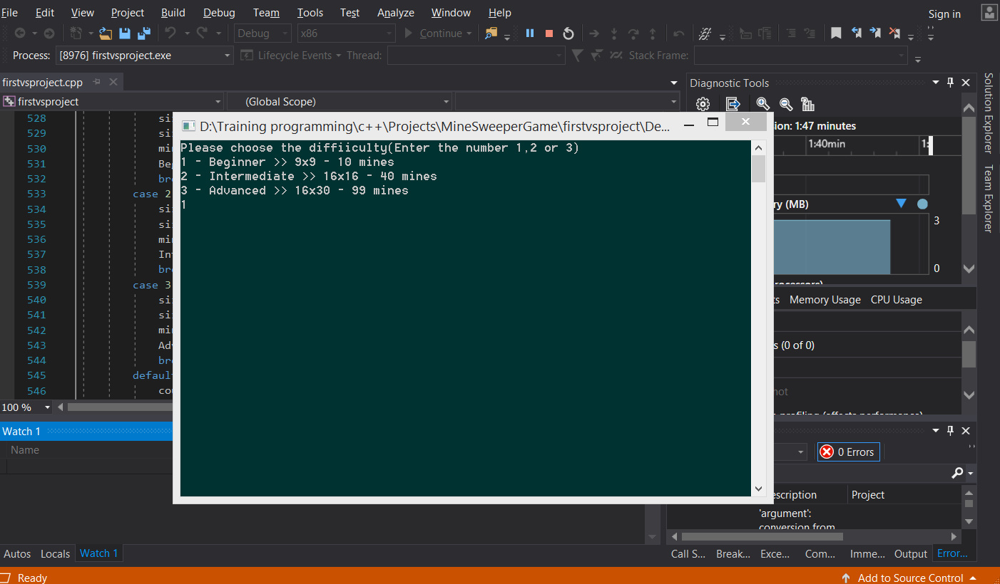
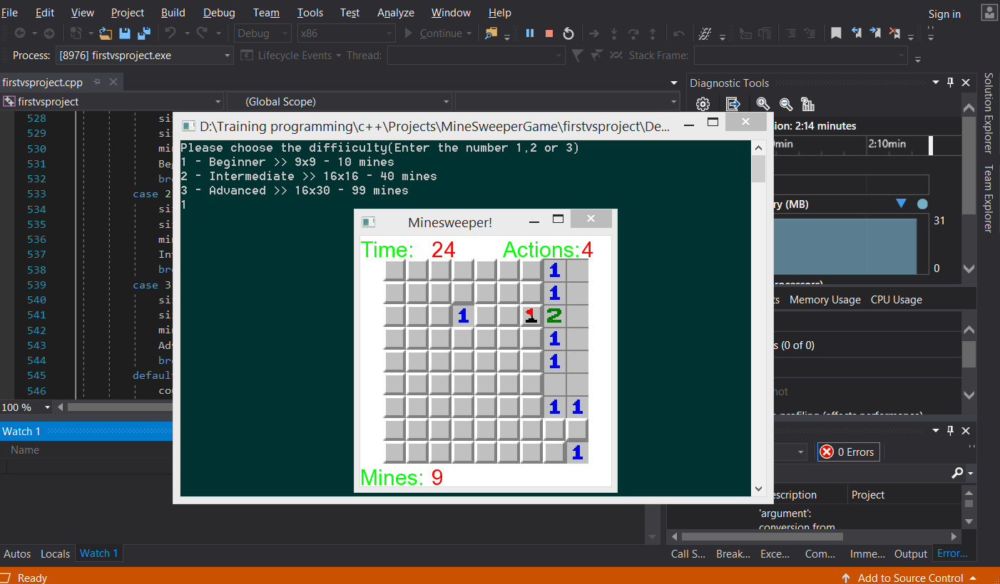
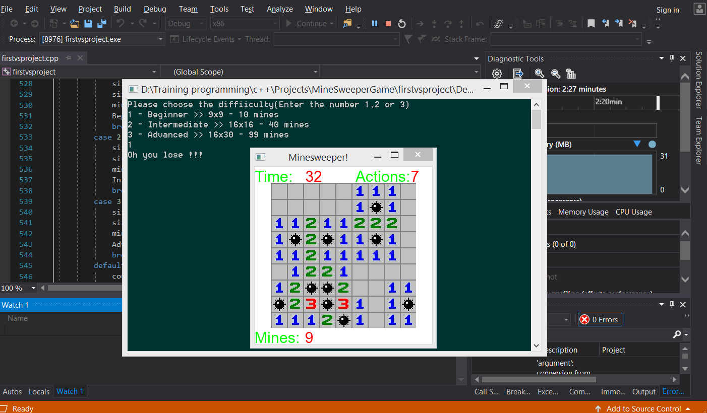

# MineSweeperGameCpp

This is a Minesweeper game made with C++ and SFML (Simple and Fast Multimedia Library) for 2D-Game and Graphics, audio and input handling in Visual Studio IDE.

This is a showcase of the game:

You can choose the difficulty level of the game(for example beginner):

Mouse(left,right) clicks will be handled by SFML and we have set a timer and actions count in the game:

Be carefull not to click on mines ;)

